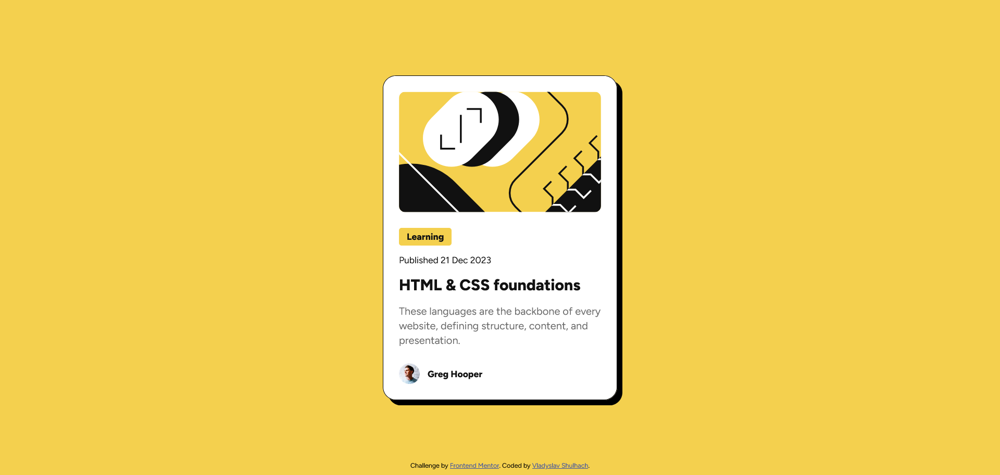

# Frontend Mentor - Blog preview card solution

This project is a solution to the [Blog preview card challenge on Frontend Mentor](https://www.frontendmentor.io/challenges/blog-preview-card-ckPaj01IcS). These challenges are designed to enhance coding skills through building practical, real-world projects.

## Table of contents

- [Overview](#overview)
  - [The challenge](#the-challenge)
  - [Screenshot](#screenshot)
  - [Links](#links)
- [My process](#my-process)
  - [Built with](#built-with)
  - [What I learned](#what-i-learned)
  - [Useful resources](#useful-resources)
- [Author](#author)

## Overview

### The challenge

Users should be able to:

- See hover and focus states for all interactive elements on the page

### Screenshot

This screenshot reflects the exact design, showing how well the code matches the intended layout. It also demonstrates the hover effect applied to the card, which adds a nice interactive touch.

### Links

- Solution URL: [Add solution URL here](https://your-solution-url.com)
- Live Site URL: [My live site URL here](https://blog-preview-card-main-one-delta.vercel.app/)

## My process

### Built with

- Semantic HTML
- CSS
- Flexbox
- Hover Effects
- Mobile Version

### What I Learned

I learned how to structure a card component effectively, incorporating hover effects and a responsive mobile version to enhance user experience. I used the **BEM methodology** to organize HTML, ensuring a clean and maintainable structure. Additionally, I applied **Flexbox** for layout management, added **hover effects** to improve interactivity, and used a **media querie** to create a responsive design suitable for mobile devices.

### Useful Resources

- [BEM Methodology](https://en.bem.info/methodology/) - This resource provided a clear explanation of the BEM methodology, which I found invaluable for organising and structuring HTML in a clean and maintainable way. It made the process of creating well-structured, reusable components much easier.
  
- [Flexbox Froggy](https://flexboxfroggy.com/) - An excellent game that made learning Flexbox both fun and intuitive. It helped solidify my understanding of Flexbox layout techniques and I highly recommend it to anyone looking to grasp this concept in an engaging way.

## Author

- Frontend Mentor - [Vladyslav Shulhach](https://www.frontendmentor.io/profile/Vladyslav-Shulhach)
